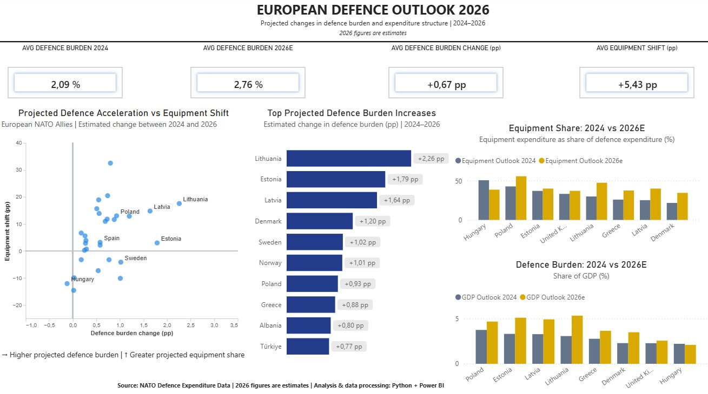

# European Defence Analytics

### NATO Defence Spending, Burden-Sharing & Strategic Investment | 2014–2026

An end-to-end data analytics project exploring how European NATO Allies have transformed their defence spending since 2014, with a particular focus on defence burden, equipment investment and the projected outlook for 2026.

The project combines **Python** for data cleaning, transformation and validation with **Power BI** for interactive analytical dashboards.

---

## Project Overview

European defence investment has changed significantly over the last decade.

This project analyses NATO defence expenditure data to answer questions such as:

* How has the defence burden evolved across European NATO Allies since 2014?
* Which countries have increased defence spending the most?
* Has higher defence spending translated into greater equipment investment?
* How has the structure of defence expenditure changed?
* Which countries show the strongest strategic transformation?
* What does the 2026 estimated outlook suggest about the direction of European defence investment?

The analysis covers **2014–2026**, with 2025 and 2026 treated as estimates where indicated in the NATO source data.

---

## Key Findings

### 1. European defence burden has increased substantially since 2014

Across the 29 European NATO Allies included in the analysis, average defence expenditure as a share of GDP increased from approximately **1.30% in 2014 to 2.09% in 2024**.

This represents an increase of around **0.80 percentage points**, equivalent to a relative increase of approximately **62%** in the simple cross-country average.

Importantly, every country included in the analysis recorded a higher defence burden in 2024 than in 2014, although the magnitude of the increase varied considerably between countries.

---

### 2. The 2% threshold has shifted from being relatively uncommon to becoming widespread

In 2014, only **2 of the 29 European Allies** included in the analysis spent at least 2% of GDP on defence.

By 2024, this had increased to **16 of 29 countries**.

Based on the 2026 estimates, **28 of the 29 countries** are projected to reach or exceed 2% of GDP, with Slovenia remaining below that level at approximately **1.61%**.

This illustrates how the distribution of defence burden across Europe has changed, rather than the increase being driven only by a small number of high-spending countries.

---

### 3. The Baltic states and Poland show some of the strongest long-term increases in defence burden

Between 2014 and 2024, the largest increases in defence expenditure as a share of GDP were recorded by:

* **Latvia: +2.31 pp**
* **Lithuania: +2.19 pp**
* **Poland: +1.89 pp**
* **Estonia: +1.41 pp**

This pattern continues in the 2026 outlook.

The highest projected defence burdens in 2026 are:

* **Lithuania: 5.33% of GDP**
* **Estonia: 5.10%**
* **Latvia: 4.92%**
* **Poland: 4.68%**

The strongest projected increases between 2024 and 2026 are also concentrated among several of these countries, particularly Lithuania (**+2.26 pp**), Estonia (**+1.79 pp**) and Latvia (**+1.64 pp**).

---

### 4. The transformation is not only about spending more, but also about changing the structure of defence budgets

The composition of defence expenditure changed significantly between 2014 and 2024.

Average equipment expenditure increased from approximately **13.45% of defence expenditure in 2014 to 29.44% in 2024**, an increase of almost **16 percentage points**.

At the same time, the average share allocated to personnel decreased from approximately **60.26% to 39.65%**, a reduction of more than **20 percentage points**.

This suggests a broad structural shift away from personnel-heavy expenditure towards greater investment in equipment and other capability-related areas.

---

### 5. Equipment investment increased in almost every country, but the scale of transformation differs significantly

Between 2014 and 2024, **28 of the 29 countries** included in the analysis increased the proportion of their defence expenditure allocated to equipment.

Some of the largest increases were:

* **Hungary: +43.09 pp**
* **Czechia: +33.17 pp**
* **Finland: +30.30 pp**
* **Bulgaria: +27.65 pp**
* **Slovenia: +24.32 pp**
* **North Macedonia: +24.31 pp**
* **Poland: +24.06 pp**

Sweden was the main exception, with its equipment share decreasing by approximately **10.91 percentage points** between 2014 and 2024 despite a substantial increase in its overall defence burden.

This highlights that an increase in defence spending does not necessarily imply the same type of budgetary transformation in every country.

---

### 6. Several countries experienced a major reallocation away from personnel expenditure

The decline in personnel expenditure was particularly pronounced in several countries.

Between 2014 and 2024, some of the largest reductions in personnel share were recorded by:

* **Czechia: -33.13 pp**
* **Montenegro: -31.18 pp**
* **Slovenia: -30.29 pp**
* **Belgium: -29.85 pp**
* **North Macedonia: -29.57 pp**
* **Luxembourg: -28.72 pp**
* **Hungary: -28.18 pp**
* **Lithuania: -27.76 pp**

These changes reinforce the idea that the transformation of European defence spending involves not only larger budgets, but also significant internal reallocations between expenditure categories.

---

### 7. Similar defence burdens can correspond to very different spending structures

The Country Explorer shows that headline defence expenditure as a percentage of GDP does not fully describe a country's defence investment strategy.

For example, in 2024:

* **France** spent approximately **2.04% of GDP** on defence, with **27.45%** allocated to equipment.
* **Germany** spent approximately **2.00% of GDP**, with **21.17%** allocated to equipment.
* **United Kingdom** spent approximately **2.28% of GDP**, with **33.36%** allocated to equipment.

Other countries display even more distinctive expenditure structures.

**Greece**, for example, had a relatively high defence burden of **2.77% of GDP in 2024**, but approximately **61.12%** of its defence expenditure was still allocated to personnel.

By contrast, **Hungary** allocated approximately **50.85%** of defence expenditure to equipment, while Poland allocated approximately **42.90%**.

This demonstrates why analysing expenditure composition alongside overall defence burden provides a more complete picture of defence investment.

---

### 8. The 2026 outlook indicates a further acceleration in defence spending

Average defence burden across the European Allies included in the analysis increases from **2.09% of GDP in 2024 to 2.76% in 2026E**.

This represents an average increase of approximately **+0.67 percentage points in only two years**.

The strongest projected increases are:

* **Lithuania: +2.26 pp**
* **Estonia: +1.79 pp**
* **Latvia: +1.64 pp**
* **Denmark: +1.20 pp**
* **Sweden: +1.02 pp**
* **Norway: +1.01 pp**
* **Poland: +0.93 pp**
* **Greece: +0.88 pp**

Hungary is the only country in the dataset with a small projected decline in defence burden between 2024 and 2026, from **2.21% to 2.09% of GDP**.

---

### 9. Higher projected defence spending does not translate uniformly into higher equipment shares

Across the 29 countries, the average equipment allocation increases by approximately **+5.43 percentage points between 2024 and 2026E**.

However, this average hides substantial differences between countries.

Some of the largest projected increases are:

* **Albania: +32.52 pp**
* **Luxembourg: +20.47 pp**
* **Portugal: +18.92 pp**
* **Lithuania: +17.55 pp**
* **Montenegro: +15.64 pp**
* **Latvia: +14.79 pp**
* **Netherlands: +13.87 pp**
* **Poland: +13.01 pp**

At the same time, **8 countries** are projected to reduce the share of defence expenditure allocated to equipment between 2024 and 2026.

Among the largest decreases are:

* **Czechia: -14.61 pp**
* **Hungary: -12.10 pp**
* **Norway: -10.15 pp**
* **Slovak Republic: -9.95 pp**
* **Finland: -7.31 pp**
* **Sweden: -4.15 pp**

The relationship between higher defence burden and higher equipment allocation is therefore positive overall, but far from uniform. Countries appear to be following different expenditure strategies even within the broader trend of rising defence budgets.

---

### 10. Overall, European defence is undergoing both a quantitative and structural transformation

The results point to two simultaneous developments.

First, European NATO Allies are generally allocating a larger share of their economies to defence.

Second, the internal structure of those defence budgets has also changed substantially, particularly through increased equipment investment and lower personnel shares.

The 2026 estimates suggest that this process is continuing and, in several countries, accelerating.

However, the country-level analysis also shows significant heterogeneity. Similar levels of defence burden can be associated with very different expenditure structures, and rising budgets do not always translate into higher equipment shares.

For this reason, analysing defence expenditure solely as a percentage of GDP provides only a partial view. Combining **defence burden, expenditure composition and changes over time** provides a more complete picture of the transformation taking place across European defence investment.

---

## Dashboards

### 1. European Defence Overview

A high-level overview of the evolution of European NATO defence expenditure, including defence burden, spending trends and investment patterns.


---

### 2. Country Explorer

An interactive country-level view designed to compare national defence trajectories and expenditure structures across the dataset.


---

### 3. Strategic Transformation

Analysis of the structural change in European defence spending between 2014 and 2024, combining changes in defence burden with changes in equipment and personnel allocation.


---

### 4. European Defence Outlook 2026

A forward-looking comparison of the 2024 position with NATO's 2026 estimates.

Across the European countries included in the analysis:

* Average defence burden increases from **2.09% of GDP in 2024** to **2.76% in 2026E**
* Average defence burden change: **+0.67 percentage points**
* Average equipment allocation change: **+5.43 percentage points**

The dashboard also identifies the countries expected to experience the strongest increases in defence burden and examines whether higher spending is accompanied by greater equipment investment.



---

## Data Pipeline

The project follows an end-to-end analytical workflow:

**NATO source data → Python → Data validation → Processed analytical model → Power BI**

### Python

Python was used to:

* Import and inspect the original NATO datasets
* Standardise country and year structures
* Transform defence expenditure indicators
* Separate observed and estimated values
* Create analytical variables
* Calculate changes in defence burden and expenditure structure
* Generate the datasets used by Power BI
* Perform automated final data-quality checks

### Power BI

Power BI was used to:

* Build the analytical data model
* Create DAX measures and KPIs
* Develop country-level comparisons
* Analyse long-term strategic change
* Visualise the 2026 defence outlook

---

## Data Quality Assurance

Before publication, automated QA checks were implemented in Python to validate the analytical datasets.

The checks include:

* Country-year uniqueness
* Complete 2014–2026 temporal coverage
* Historical vs estimated data classification
* Core indicator completeness
* Defence expenditure composition consistency
* Strategic Change calculations
* Defence Outlook calculations
* Power BI headline KPI validation

All final QA checks passed successfully before the dashboards were finalised.

---

## Repository Structure

```text
european-defence-analytics/
│
├── README.md
├── requirements.txt
│
├── notebooks/
│   └── 01_data_exploration.ipynb
│
├── data/
│   └── processed/
│       └── european_defence_powerbi.xlsx
│
└── dashboard/
    └── screenshots/
        ├── 01_European_Defence_Overview.jpg
        ├── 02_Country_Explorer.jpg
        ├── 03_Strategic_Transformation.jpg
        └── defence_outlook_2026.jpg
```

---

## Tools & Technologies

* **Python**
* **Pandas**
* **NumPy**
* **Matplotlib**
* **Power BI**
* **DAX**
* **Power Query**
* **Excel**
* **Jupyter Notebook**
* **GitHub**

---

## Data Source

**NATO – Defence Investment / Defence Expenditure Data**

Official NATO defence expenditure publications and accompanying Excel tables:

https://www.nato.int/en/news-and-events/articles/news/2026/07/07/defence-investment-update-record-spending-in-europe-and-canada

---

## Methodological Note

The project focuses on **29 European NATO Allies** for which comparable defence expenditure data are available in the analytical dataset.

Cross-country averages reported in this project are **simple, unweighted averages across the countries included in the analysis**, unless otherwise stated.

Values identified by NATO as estimates are treated separately from historical observations. In particular, **2025 and 2026 figures should be interpreted as estimates rather than realised expenditure outcomes**.

Changes expressed in **percentage points (pp)** represent absolute differences between percentage values rather than percentage growth rates.

Because of rounding in the original source data, expenditure categories may not always sum to exactly 100%.

The findings presented in this project are descriptive and should not be interpreted as evidence of causal relationships between changes in defence burden and changes in expenditure composition.

---

## Author

**Pedro Medina**

Business Analytics | Data Analysis | European Defence & Security

---

*Personal portfolio project based on publicly available NATO data. This project is independent and is not affiliated with or endorsed by NATO.*
