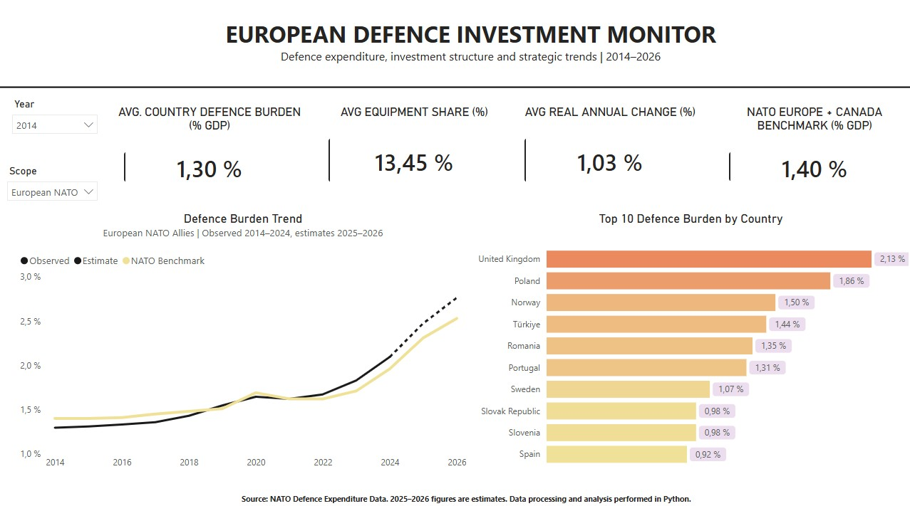
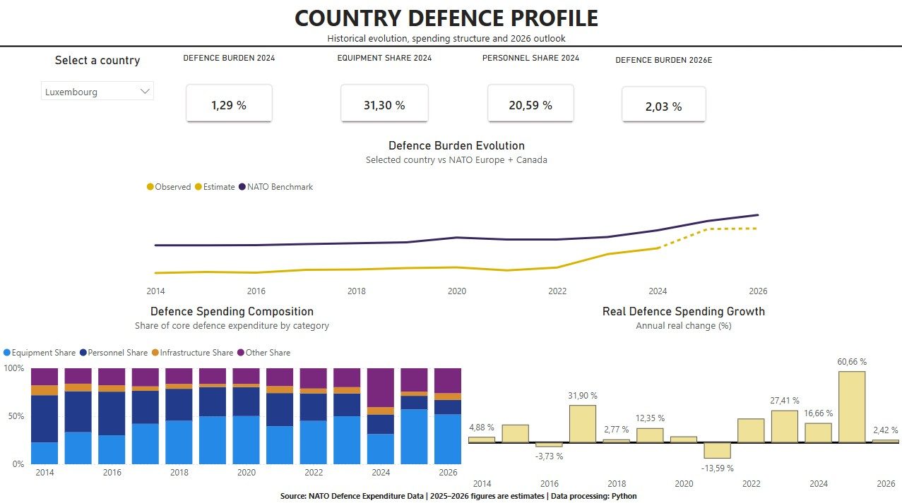
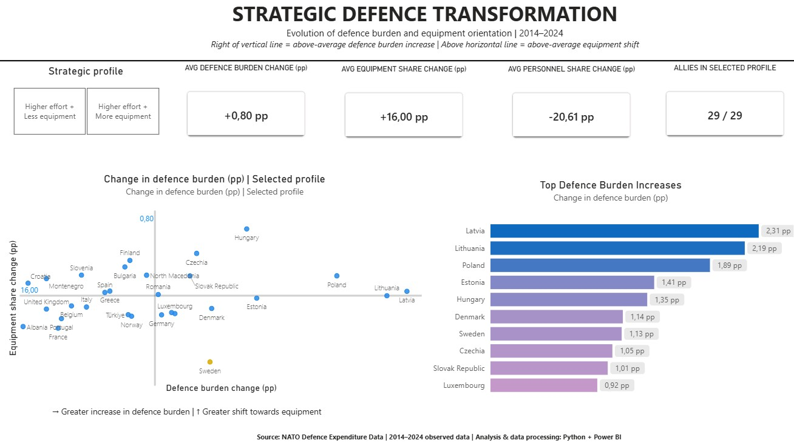

# European Defence Analytics

### NATO Defence Spending, Burden-Sharing & Strategic Investment | 2014–2026

An end-to-end data analytics project exploring how European NATO Allies have transformed their defence spending since 2014, with a particular focus on defence burden, equipment investment and the projected outlook for 2026.

The project combines **Python** for data cleaning, transformation and validation with **Power BI** for interactive analytical dashboards.

---

## Project Overview

European defence investment has changed significantly over the last decade.

This project analyses NATO defence expenditure data to answer questions such as:

- How has the defence burden evolved across European NATO Allies since 2014?
- Which countries have increased defence spending the most?
- Has higher defence spending translated into greater equipment investment?
- How has the structure of defence expenditure changed?
- Which countries show the strongest strategic transformation?
- What does the 2026 estimated outlook suggest about the direction of European defence investment?

The analysis covers **2014–2026**, with 2025 and 2026 treated as estimates where indicated in the NATO source data.

---

## Dashboards

### 1. European Defence Overview

A high-level overview of the evolution of European NATO defence expenditure, including defence burden, spending trends and investment patterns.



---

### 2. Country Explorer

An interactive country-level view designed to compare national defence trajectories and expenditure structures across the dataset.



---

### 3. Strategic Transformation

Analysis of the structural change in European defence spending between 2014 and 2024, combining changes in defence burden with changes in equipment and personnel allocation.



---

### 4. European Defence Outlook 2026

A forward-looking comparison of the 2024 position with NATO's 2026 estimates.

Across the European countries included in the analysis:

- Average defence burden increases from **2.09% of GDP in 2024** to **2.76% in 2026E**
- Average defence burden change: **+0.67 percentage points**
- Average equipment allocation change: **+5.43 percentage points**

The dashboard also identifies the countries expected to experience the strongest increases in defence burden and examines whether higher spending is accompanied by greater equipment investment.


---

## Data Pipeline

The project follows an end-to-end analytical workflow:

**NATO source data → Python → Data validation → Processed analytical model → Power BI**

### Python

Python was used to:

- Import and inspect the original NATO datasets
- Standardise country and year structures
- Transform defence expenditure indicators
- Separate observed and estimated values
- Create analytical variables
- Calculate changes in defence burden and expenditure structure
- Generate the datasets used by Power BI
- Perform automated final data-quality checks

### Power BI

Power BI was used to:

- Build the analytical data model
- Create DAX measures and KPIs
- Develop country-level comparisons
- Analyse long-term strategic change
- Visualise the 2026 defence outlook

---

## Data Quality Assurance

Before publication, automated QA checks were implemented in Python to validate the analytical datasets.

The checks include:

- Country-year uniqueness
- Complete 2014–2026 temporal coverage
- Historical vs estimated data classification
- Core indicator completeness
- Defence expenditure composition consistency
- Strategic Change calculations
- Defence Outlook calculations
- Power BI headline KPI validation

All final QA checks passed successfully before the dashboards were finalised.

---

## Repository Structure

```text
european-defence-analytics/
│
├── README.md
├── requirements.txt
│
├── notebooks/
│   └── 01_data_exploration.ipynb
│
├── data/
│   └── processed/
│       └── european_defence_powerbi.xlsx
│
└── dashboard/
    └── screenshots/
        ├── 01_European_Defence_Overview.jpg
        ├── 02_Country_Explorer.jpg
        ├── 03_Strategic_Transformation.jpg
        └── 04_2026_Defence_Outlook.jpg
```

---

## Tools & Technologies

- **Python**
- **Pandas**
- **NumPy**
- **Matplotlib**
- **Power BI**
- **DAX**
- **Power Query**
- **Excel**
- **Jupyter Notebook**
- **GitHub**

---

## Data Source

**NATO – Defence Investment / Defence Expenditure Data**

Official NATO defence expenditure publications and accompanying Excel tables:

https://www.nato.int/en/news-and-events/articles/news/2026/07/07/defence-investment-update-record-spending-in-europe-and-canada

---

## Methodological Note

The project focuses on European NATO Allies for which comparable defence expenditure data are available in the analytical dataset.

Values identified by NATO as estimates are treated separately from historical observations.

Changes expressed in **percentage points (pp)** represent absolute differences between percentage values rather than percentage growth rates.

Because of rounding in the original source data, expenditure categories may not always sum to exactly 100%.

---

## Author

**Pedro Medina**

Business Analytics | Data Analysis | European Defence & Security

---

*Personal portfolio project based on publicly available NATO data. This project is independent and is not affiliated with or endorsed by NATO.*
